<div align="center">

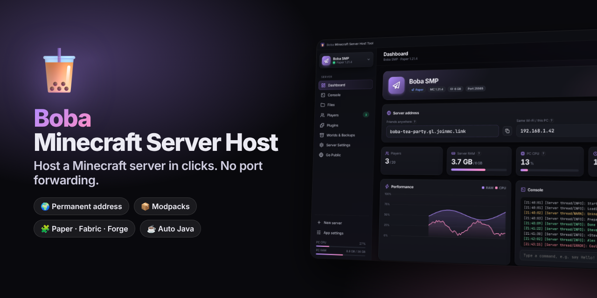

# 🧋 Boba Minecraft Server Host Tool

**The free, open-source desktop app to host your own Minecraft server in a few clicks. No port forwarding, a permanent address for your friends, and every setting explained.**

[](#-quick-start)
[](https://www.electronjs.org/)
[](LICENSE)
[](#-supported-server-types)
[](https://modrinth.com)
[](https://github.com/tabslvss/boba-minecraft-server-host/stargazers)

[**Quick start**](#-quick-start) · [**Features**](#-features) · [**Screenshots**](#-screenshots) · [**No port forwarding**](#-how-no-port-forwarding-works) · [**FAQ**](#-faq) · [**Contributing**](#-contributing)

</div>

---

## ✨ Why Boba?

Hosting a Minecraft server usually means installing Java, downloading the right jar, editing config files, and opening ports on your router. **Boba does all of that for you**, in a clean, modern app.

- 🌍 **No port forwarding.** A free [playit.gg](https://playit.gg) tunnel gives you an address like `boba-tea.joinmc.link` that **stays the same every time you boot**.
- 📦 **Every server type.** Vanilla, Paper, Purpur, Fabric, Quilt, Forge, NeoForge, or a full **Modrinth modpack** in one click.
- ☕ **Java handled for you.** The right Java version (8, 17, 21, 25…) downloads automatically from Eclipse Temurin.
- 🧩 **Mods & plugins built in.** Search Modrinth, click install, and required dependencies come too.
- 🛟 **Safe by default.** Auto-restart after a crash, scheduled backups, and deleted files go to the Recycle Bin.
- 🎨 **Looks good.** Dark and light themes, 6 accent colors, and every setting has a tooltip with an example.

---

## 🚀 Quick start

> **Requirements:** Windows 10/11 and [Node.js LTS](https://nodejs.org) (one-time install). Boba downloads everything else by itself.

1. **[Download this project](../../archive/refs/heads/main.zip)** and unzip it (or `git clone` it).
2. Double-click **`Start Boba.bat`**. The first launch installs the app's parts (1–2 minutes).
3. Click **New server**, pick a type, tick the EULA, and press **Create**.
4. Press **Start**, then open **Go Public** to get your permanent address.

```bash
# Or from a terminal
git clone https://github.com/tabslvss/boba-minecraft-server-host.git
cd boba-minecraft-server-host
npm install
npm start
```

---

## 🧰 Features

| Area | What you get |
|---|---|
| **Dashboard** | Live status, your public address with a copy button, players online, RAM / CPU chart, uptime and a mini console |
| **Console** | Live colored logs, filter, timestamps, command **suggestions** (Tab), **history** (↑ ↓) and quick-action buttons |
| **System terminal** | A Windows Command Prompt opened right inside the server folder |
| **File explorer** | Browse, edit with line numbers (Ctrl+S), drag & drop upload, rename, zip / unzip, Recycle Bin delete |
| **Players** | Online list with skins, op / de-op, kick, ban / unban, whitelist, change game mode |
| **Mods & plugins** | Search **Modrinth**, filtered to your loader and version, one-click install, enable / disable / delete |
| **Modpacks** | Install any Modrinth modpack (or a `.mrpack` file) with its loader, mods and configs |
| **Worlds & backups** | One-click or **scheduled** backups (worlds-only or full), keep the newest N, one-click restore |
| **Server settings** | Every `server.properties` option grouped and explained, with a **live MOTD color preview** |
| **Server picture** | Random Minecraft mob heads or DiceBear avatars. Shuffle until you love one, or upload your own |
| **Automation** | Start with Windows, auto-start servers, auto-restart on crash, daily restart time |
| **Performance** | RAM slider, Aikar's optimized JVM flags, automatic Java version, custom Java / jar |
| **Multiple servers** | Run several servers side by side, with port conflict detection |

---

## 📸 Screenshots

<table>
  <tr>
    <td>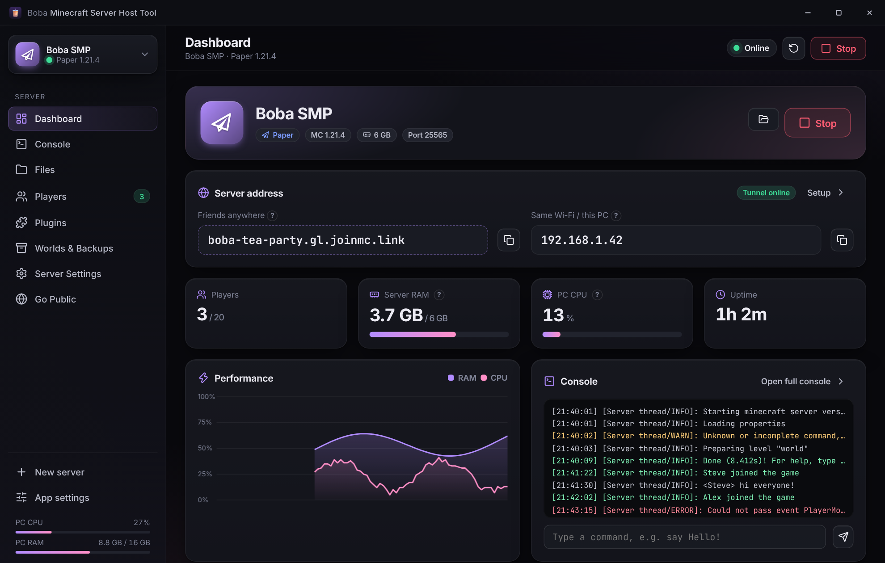</td>
    <td>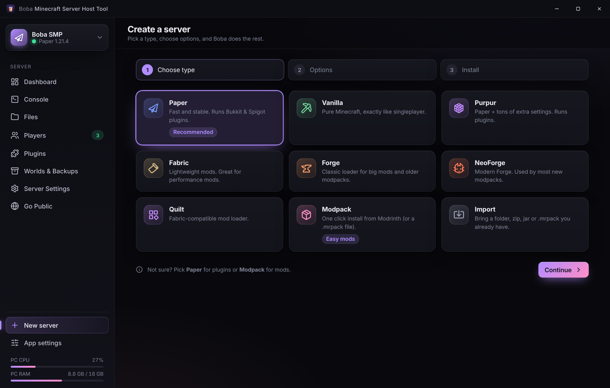</td>
  </tr>
  <tr>
    <td align="center"><b>Dashboard</b>: address, stats and live chart</td>
    <td align="center"><b>Create</b>: every server type in one place</td>
  </tr>
  <tr>
    <td>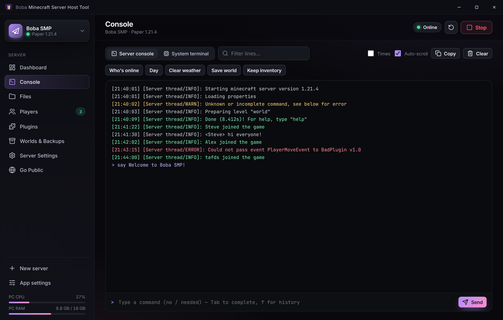</td>
    <td>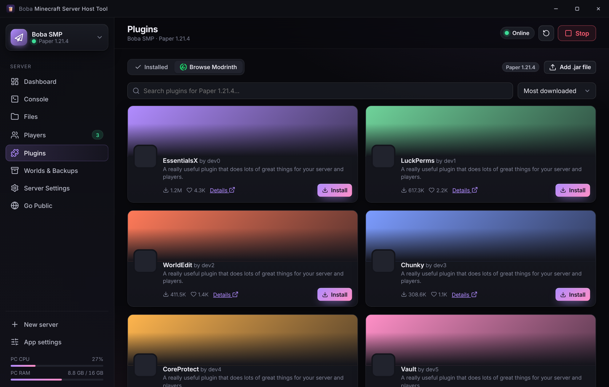</td>
  </tr>
  <tr>
    <td align="center"><b>Console</b>: colors, suggestions and history</td>
    <td align="center"><b>Mods & plugins</b>: straight from Modrinth</td>
  </tr>
  <tr>
    <td>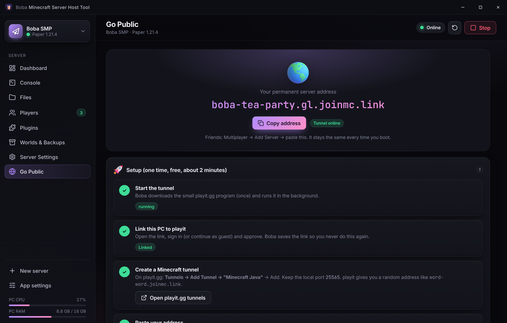</td>
    <td>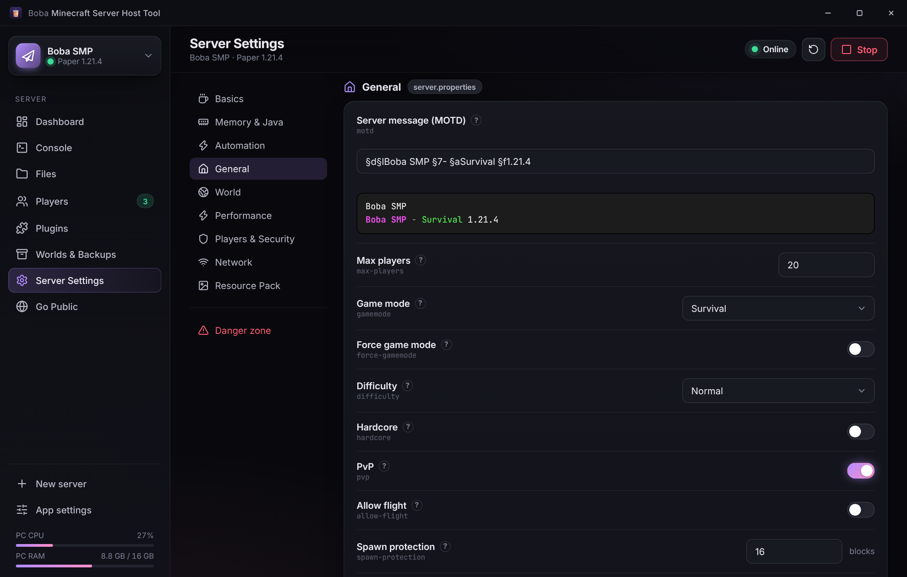</td>
  </tr>
  <tr>
    <td align="center"><b>Go Public</b>: no port forwarding</td>
    <td align="center"><b>Settings</b>: every option explained</td>
  </tr>
  <tr>
    <td>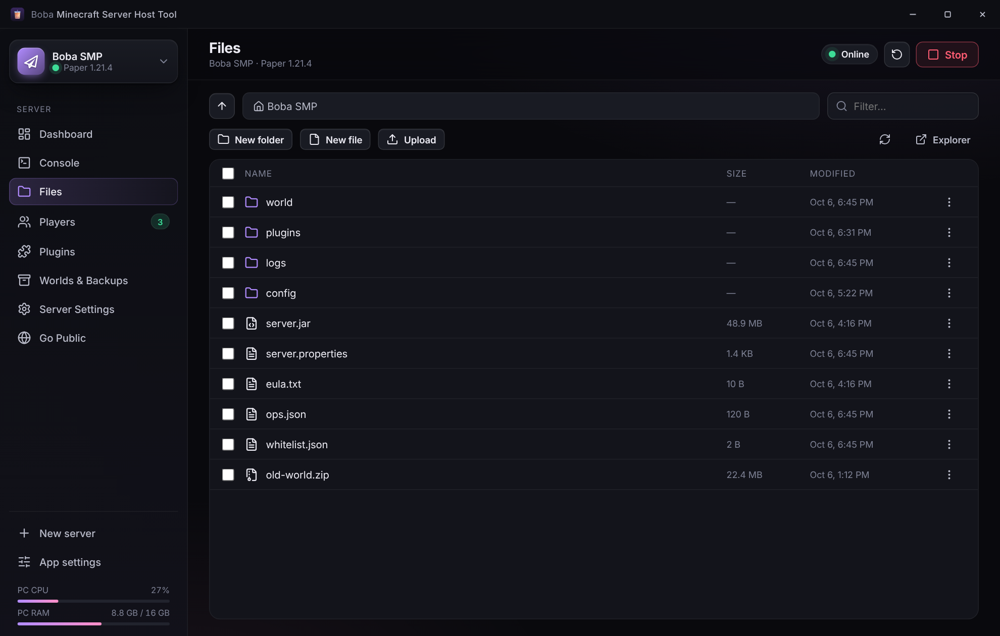</td>
    <td>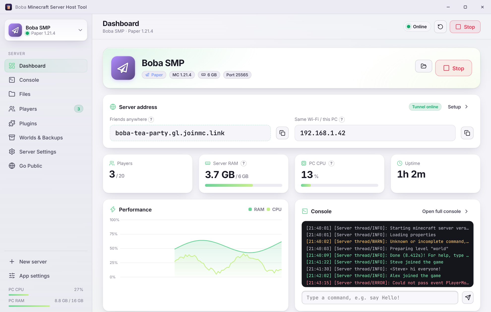</td>
  </tr>
  <tr>
    <td align="center"><b>Files</b>: edit, upload, zip</td>
    <td align="center"><b>Light theme</b>: with the Matcha flavor</td>
  </tr>
</table>

<details>
<summary><b>More screenshots</b></summary>

| Players | Worlds & Backups | Welcome |
|---|---|---|
| 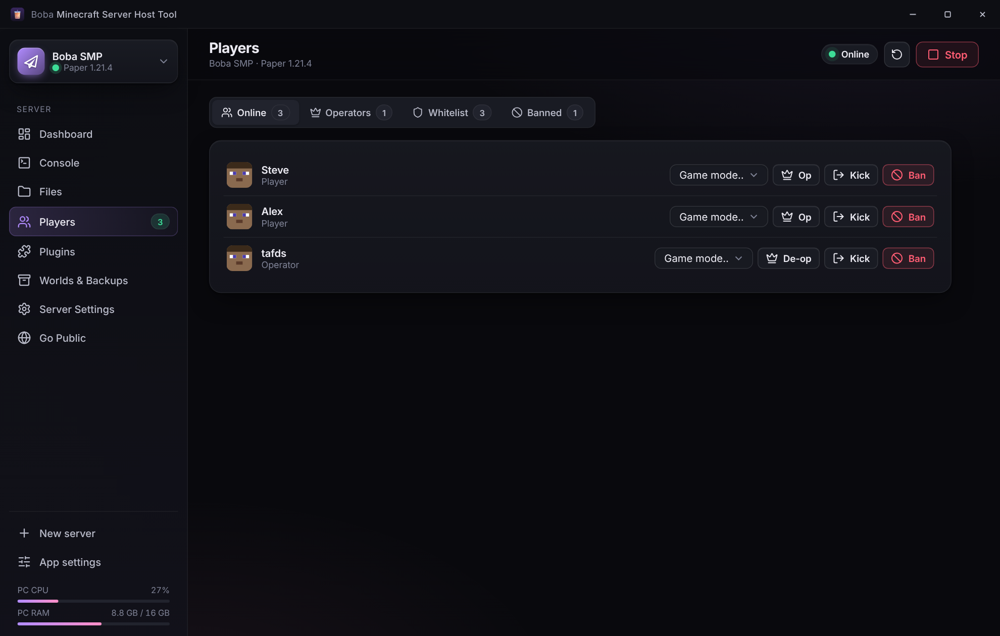 | 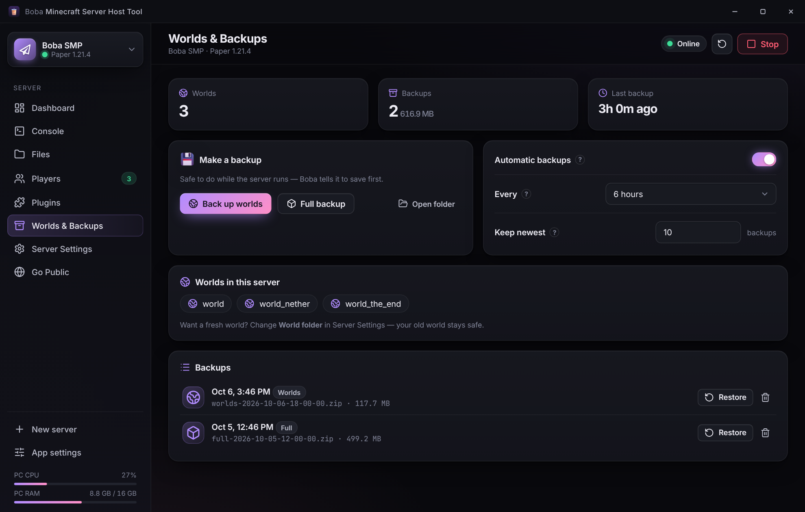 | 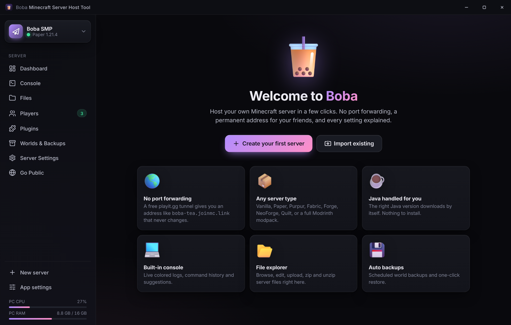 |

</details>

---

## 🎮 Supported server types

| Type | Best for | Mods / plugins |
|---|---|---|
| **Paper** ⭐ | Most servers. Fast and stable | Bukkit / Spigot / Paper plugins |
| **Purpur** | Paper plus lots of extra settings | Bukkit / Spigot / Paper plugins |
| **Vanilla** | Pure Minecraft, like singleplayer | None |
| **Fabric** | Lightweight mods, performance mods | Fabric mods |
| **Quilt** | Fabric-compatible loader | Quilt + most Fabric mods |
| **Forge** | Classic big mods and older modpacks | Forge mods |
| **NeoForge** | Modern Forge, used by most new modpacks | NeoForge mods |
| **Modpack** | One click: loader + mods + configs | From Modrinth or a `.mrpack` file |
| **Import** | Your existing server folder, zip or jar | Whatever it already has |

---

## 🌍 How "no port forwarding" works

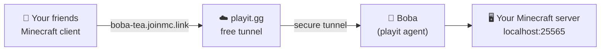

1. Boba downloads the small official **playit.gg agent** and runs it in the background.
2. You link your PC **once** (open a link, approve it).
3. On playit.gg you add a **Minecraft Java** tunnel. It gives you a random address like `word-word.joinmc.link`.
4. Boba saves your link, so the **address is the same every boot**. Turn on *Start with Windows* for a 24/7 server.

> Prefer port forwarding or LAN? The **Go Public** page also shows your LAN address and which port to forward.

---

## ❓ FAQ

<details>
<summary><b>How do I host a Minecraft server for free without port forwarding?</b></summary>

Install Boba, create a server, then open **Go Public** and follow the 4 steps. Boba uses the free playit.gg tunnel, so you never touch your router.
</details>

<details>
<summary><b>Will my server address change when I restart my PC?</b></summary>

No. playit picks a random address once, and Boba keeps your PC linked to it. The address stays the same every boot.
</details>

<details>
<summary><b>Do I need to install Java?</b></summary>

No. Boba reads which Java your Minecraft version needs and downloads it (Eclipse Temurin) into the app folder.
</details>

<details>
<summary><b>How much RAM should I give my server?</b></summary>

About 2–4 GB for Vanilla or Paper with a few friends, and 6–10 GB for big modpacks. Leave at least 2 GB for Windows.
</details>

<details>
<summary><b>Can I install CurseForge modpacks?</b></summary>

Yes. Download the pack's **Server Pack** zip from CurseForge, then use **New server → Import → Server .zip**. Modrinth packs install directly in one click.
</details>

<details>
<summary><b>Is it safe?</b></summary>

Boba is open source. The file explorer can only touch files inside each server folder. Deleted files go to the Recycle Bin, and your playit link is stored locally in `data/` (never committed to git).
</details>

<details>
<summary><b>Does it work on Mac or Linux?</b></summary>

Boba is built and tested for Windows. Most of it is cross-platform (Electron + Node.js), so pull requests for macOS and Linux are welcome!
</details>

---

## 🏗️ Tech stack & project structure

**Electron** · **Node.js** · plain **HTML / CSS / JavaScript** (no build step, beginner friendly, every file commented).

```text
boba-minecraft-server-host/
├── main.js              # Electron main process: window, tray, IPC handlers
├── preload.js           # Safe bridge between the UI and Node
├── backend/
│   ├── servers.js       # Create / start / stop servers, logs, players, stats, backups
│   ├── platforms.js     # Vanilla, Paper, Purpur, Fabric, Quilt, Forge, NeoForge installers
│   ├── java.js          # Finds or downloads the right Java (Adoptium Temurin)
│   ├── modrinth.js      # Modrinth search, mod / plugin / modpack (.mrpack) installs
│   ├── tunnel.js        # playit.gg tunnel (no port forwarding)
│   ├── files.js         # Sandboxed file explorer
│   ├── properties.js    # server.properties reader / writer
│   ├── terminal.js      # Built-in system terminal
│   ├── net.js           # Downloads with progress
│   └── store.js         # App settings + folders
├── renderer/            # The UI
│   ├── index.html · styles.css
│   └── js/              # app.js, ui.js, icons.js, pfp.js, views/*.js (one file per page)
├── assets/              # Icons, fonts, pictures
└── docs/                # README banner + screenshots
```

Folders created at runtime (ignored by git): `servers/`, `runtime/` (Java), `tools/` (playit), `data/` (settings + playit secret).

---

## 🤝 Contributing

Contributions are welcome! Bug reports, feature ideas, translations and pull requests all help.

1. Fork the repo and create a branch: `git checkout -b feature/my-idea`
2. Run it with `npm install` and `npm start`
3. Keep code simple and commented (this project is beginner friendly)
4. Open a pull request 🎉

See [CONTRIBUTING.md](CONTRIBUTING.md) for details. Found a bug? [Open an issue](../../issues/new/choose).

---

## 🙏 Credits

- Tunnels: [playit.gg](https://playit.gg)
- Mods, plugins and modpacks: [Modrinth](https://modrinth.com) API
- Server software: [PaperMC](https://papermc.io), [PurpurMC](https://purpurmc.org), [FabricMC](https://fabricmc.net), [QuiltMC](https://quiltmc.org), [MinecraftForge](https://minecraftforge.net), [NeoForged](https://neoforged.net)
- Java: [Eclipse Temurin](https://adoptium.net) (Adoptium)
- UI icons: [Lucide](https://lucide.dev) (ISC) · Loader icons: [Modrinth](https://github.com/modrinth/code) · Brand marks: [Simple Icons](https://simpleicons.org) (CC0)
- 3D pictures and app icon: [Microsoft Fluent Emoji](https://github.com/microsoft/fluentui-emoji) (MIT)
- Server pictures: [mc-heads.net](https://mc-heads.net) and [DiceBear](https://www.dicebear.com)
- Fonts: [Inter](https://rsms.me/inter/) + [JetBrains Mono](https://www.jetbrains.com/lp/mono/) via [Fontsource](https://fontsource.org) (OFL)

---

## 📄 License

[MIT](LICENSE) © tafds

<sub>Boba is not affiliated with Mojang Studios, Microsoft, playit.gg or Modrinth. "Minecraft" is a trademark of Mojang Synergies AB.</sub>

<sub>**Keywords:** minecraft server host, minecraft server manager, host minecraft server free, minecraft server without port forwarding, minecraft server gui windows, paper server, fabric server, forge server, neoforge server, modrinth modpack server, playit.gg, minecraft server panel, self-hosted minecraft</sub>

<div align="center">

**If Boba helped you, please ⭐ star the repo. It helps others find it!**

</div>
